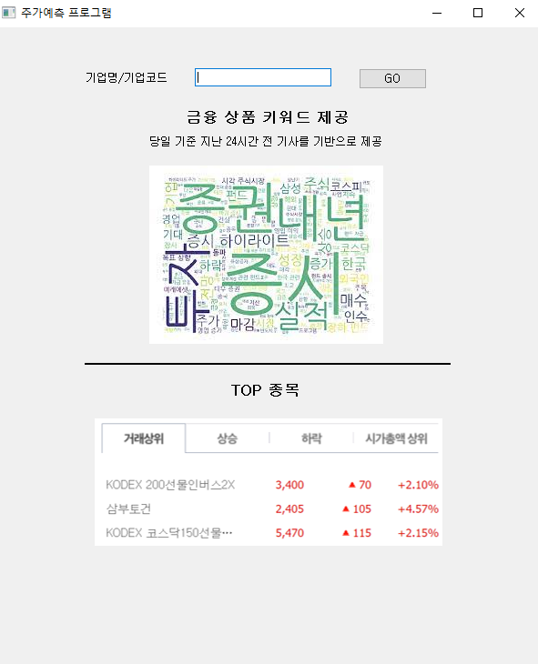
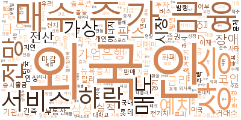
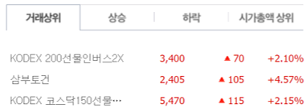

# ICT 멘토링 금융 상품 가격 예측 시스템

2022년 한이음 ICT 멘토링에서 진행한 금융 데이터 기반 가격 예측 프로젝트 기록입니다.
주가 데이터 수집, 기술적 지표 생성, ARIMA/RNN/LSTM/GRU 실험, 뉴스 워드클라우드, PyQt GUI 구현 과정을 포트폴리오용으로 정리했습니다.

## 프로젝트 개요

- **주제**: 빅데이터와 딥러닝을 활용한 금융 상품 가격 예측 시스템
- **기간**: 2022년 ICT 멘토링 수행 기록
- **핵심 흐름**: 데이터 수집 -> 전처리/피처 엔지니어링 -> 예측 모델 실험 -> 뉴스 시각화 -> GUI 구현
- **대표 종목**: 삼성전자, 삼성바이오로직스, 현대차, KB금융, SK, POSCO홀딩스, SK이노베이션, 한국전력, KT, CJ제일제당

## 기술 스택

| 영역 | 사용 기술 |
| --- | --- |
| 데이터 수집 | Python, pandas, requests, BeautifulSoup, pykrx, Kiwoom OpenAPI |
| 데이터 저장 | MySQL, SQLite, SQLAlchemy, PyMySQL |
| 분석/모델링 | NumPy, scikit-learn, TensorFlow/Keras, ARIMA, RNN, LSTM, GRU, PCA |
| 피처 엔지니어링 | 이동평균, 거래량 지표, 변동성 지표, 추세/모멘텀 지표, `ta` |
| 시각화/앱 | matplotlib, mplfinance, wordcloud, KoNLPy, PyQt5 |

## 저장소 구조

```text
.
├── src/                 # 포트폴리오용으로 정리한 대표 Python 코드
├── notebooks/           # 대표 노트북과 원본 실험 노트북 안내
├── docs/                # 프로젝트 설명, 재현 방법, 공개 정책
├── assets/              # 결과 이미지와 화면 자료
├── data/                # 공개 가능한 데이터 안내 및 샘플 데이터 위치
├── financial/           # 원본 개발/실험 파일은 로컬 보존, 공개 Git 추적은 제한
├── 22_hf352-master/     # 주차별 원본 실험 기록은 로컬 보존
└── archive/             # 공개 제외 또는 원본 보존용 로컬 자료
```

## 대표 코드

공개용 코드는 원본 실험 파일을 그대로 덮어쓰지 않고 `src/`에 읽기 좋은 형태로 정리했습니다.

- `src/config.py`: 종목 코드, 경로, DB 환경변수 설정
- `src/data_collection.py`: KRX/네이버 금융 데이터 수집
- `src/database.py`: MySQL 저장/조회와 OHLCV 정규화
- `src/features.py`: 이동평균과 기술적 지표 생성
- `src/modeling.py`: PCA, 시퀀스 데이터셋, LSTM/GRU 모델 구성
- `src/news_wordcloud.py`: 금융 뉴스 제목 수집과 워드클라우드 생성
- `src/app_main.py`: PyQt GUI 실행 진입점

## 실행 참고

이 프로젝트는 과거 팀 개발 환경에 의존하는 부분이 있습니다. 특히 Kiwoom OpenAPI, MySQL DB, KoNLPy, PyQt UI 파일은 로컬 설정이 필요합니다.

```powershell
python -m venv .venv
.\.venv\Scripts\activate
pip install -r requirements.txt
Copy-Item .env.example .env
```

`.env`에는 실제 DB 접속정보를 넣되 Git에는 커밋하지 않습니다.

## 공개용 정리 기준

- 노출되어 있던 DB 비밀번호와 원격 DB 주소는 공개 코드에서 제거했습니다.
- 개인 신청서, 카카오톡 캡처, 실행 파일, IDE 설정, 중복 압축 파일은 Git 추적에서 제외했습니다.
- 100MB를 넘는 `financial/dailychart.csv`는 GitHub 일반 Git 제한 때문에 Git LFS 대상으로 지정했습니다.
- 원본 실험 기록은 로컬에 보존하되, 포트폴리오에서 읽을 대표 구현은 `src/`와 `notebooks/`에 따로 정리했습니다.

## 결과물

- 주가 데이터 수집 및 DB 적재 스크립트
- ARIMA/RNN/LSTM/GRU 기반 주가 예측 실험
- PCA와 기술적 지표를 활용한 피처 구성
- 금융 뉴스 제목 기반 워드클라우드
- PyQt 기반 예측 결과 조회 GUI

## 예시 이미지







자세한 정리 기준은 [docs/project-summary.md](docs/project-summary.md)와 [docs/reproducibility.md](docs/reproducibility.md)를 참고하세요.
