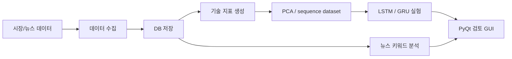

# ICT 멘토링 주가 예측 시스템

> 국내 주식 OHLCV, 기술 지표, 뉴스 키워드, 순환신경망 실험, PyQt GUI를 결합한 2022 한이음 ICT 멘토링 프로젝트입니다.

[](src)
[](docs/architecture.md)
[](docs/project-summary.md)
[](docs/reproducibility.md)

## 개요

이 저장소는 2022 한이음 ICT 멘토링 주가 예측 프로젝트를 포트폴리오 검토용으로 재구성한 버전입니다. 원본 팀 작업 공간 전체를 공개하는 대신, 데이터 수집, 지표 생성, 모델링, 뉴스 키워드 분석, GUI 구조를 이해할 수 있는 안전한 코드와 문서만 남겼습니다.

이 프로젝트는 투자 조언이나 실거래 시스템이 아니며, 공개 README는 실무자가 기술 구조와 판단 근거를 빠르게 검토할 수 있도록 작성했습니다.

## 빠른 검토 경로

| 먼저 볼 것 | 확인할 내용 |
| --- | --- |
| [docs/project-summary.md](docs/project-summary.md) | 프로젝트 목적, 역할 범위, 공개/비공개 경계 |
| [docs/architecture.md](docs/architecture.md) | 데이터 수집부터 GUI까지의 시스템 구조 |
| [docs/reproducibility.md](docs/reproducibility.md) | 실행 가능 범위와 필요한 환경 변수 |
| [docs/publication-checklist.md](docs/publication-checklist.md) | 공개 전 확인한 안전성 항목 |
| [src/](src/) | 정리된 대표 구현 코드 |

## 문제 정의

국내 주식 가격 예측 실험은 데이터 수집, 지표 생성, 모델 검증, 시각화, 사용자 확인 화면이 함께 필요합니다. 이 프로젝트는 OHLCV 데이터와 기술 지표, 금융 뉴스 키워드를 모아 예측 실험과 GUI 검토 화면까지 연결하는 구조를 탐색했습니다.

## 내 역할

팀 프로젝트 산출물이며, 이 저장소에서는 다음 기여를 공개 가능한 범위로 정리했습니다.

- 원본 멘토링 산출물을 포트폴리오용 구조로 재정리
- 데이터 수집, 저장, feature engineering, sequence modeling 흐름 문서화
- `src/`에 대표 구현 경로를 분리해 reviewer가 읽기 쉬운 구조로 개선
- raw financial data, credential, 개인/팀 작업물, 대용량 로컬 자료 제외

## 기술적 의사결정

| 영역 | 선택 | 이유 |
| --- | --- | --- |
| 데이터 수집 | pykrx, requests, BeautifulSoup, Kiwoom OpenAPI 맥락 | 국내 주식 OHLCV와 뉴스 데이터를 함께 다루기 위한 구성입니다. |
| 저장 | MySQL, SQLite, SQLAlchemy | 실험/GUI에서 반복 조회 가능한 형태로 데이터를 정규화하기 위함입니다. |
| feature engineering | 이동평균, 변동성, 거래량, 모멘텀 지표 | 시계열 가격만 쓰는 모델보다 설명 가능한 입력을 구성하기 위함입니다. |
| 모델링 | PCA, LSTM, GRU, Keras | 다변량 sequence input을 다루는 recurrent model 실험을 진행했습니다. |
| UI | PyQt5 | 비개발자도 종목 흐름과 예측 결과를 확인할 수 있는 데스크톱 화면을 목표로 했습니다. |

## 아키텍처



## 재현 가능성

공개 저장소는 inspection-first입니다. 원본 금융 데이터, API credential, 로컬 DB, GUI 실행 환경이 제외되어 clean checkout만으로 완전 재현되지는 않습니다.

```bash
pip install -r requirements.txt
```

검토 가능한 것:

- `src/`의 데이터 처리와 모델링 구조
- `docs/architecture.md`의 시스템 흐름
- `notebooks/README.md`의 실험 기록 안내

제외된 것:

- 원본 OHLCV/뉴스 데이터와 로컬 DB
- API key, 증권사 OpenAPI credential, 개인 설정 파일
- 팀 내부 workspace, raw artifact, 대용량 중간 산출물

## 공개/비공개 경계

이 저장소는 프로젝트의 engineering shape를 보여주는 목적입니다. 개인 credential, raw financial dataset, 투자 판단에 영향을 줄 수 있는 비검증 데이터, 팀 내부 문서는 공개하지 않습니다.

## 한계

- 실거래, 투자 추천, 수익률 보장을 위한 시스템이 아닙니다.
- 원본 실행 환경이 오래되어 일부 GUI/DB 경로는 그대로 실행되지 않을 수 있습니다.
- 모델 성능보다 데이터 파이프라인과 시스템 구성 경험을 보여주는 포트폴리오 성격이 강합니다.
