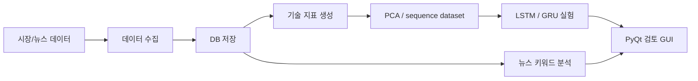
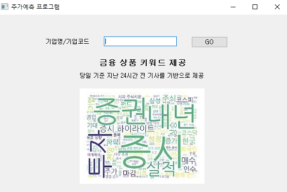
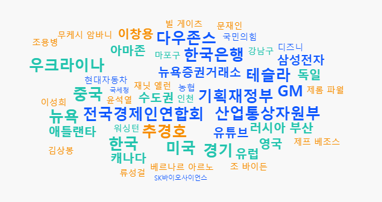

# ICT 멘토링 주가 예측 시스템

<p align="center">ICT 멘토링 · 금융 시계열 예측 · ARIMA · LSTM · GRU · Python GUI</p>

> 국내 주식 OHLCV, 기술 지표, 뉴스 키워드, 순환신경망 실험, PyQt GUI를 결합한 2022 한이음 ICT 멘토링 프로젝트입니다.

[](src)
[](docs/architecture.md)
[](docs/project-summary.md)
[](docs/reproducibility.md)

## 프로젝트 한눈에 보기

| 항목 | 내용 |
| --- | --- |
| 프로젝트 | 빅데이터와 딥러닝을 활용한 금융 상품 가격 예측 시스템 |
| 기간 | 2022년 한이음 ICT 멘토링 |
| 형태 | 팀 프로젝트 · Windows 데스크톱 프로토타입 |
| 문제 | 가격·기술 지표·뉴스 흐름이 분산되어 시계열 실험 결과를 한 흐름으로 확인하기 어려움 |
| 핵심 흐름 | 수집 → 정규화·저장 → 기술 지표 → PCA·시퀀스 모델 → 뉴스 키워드 → GUI 확인 |
| 공개 범위 | 원본 팀 작업 공간 전체가 아닌, 검토 가능한 코드·샘플 데이터·실제 화면만 선별 |

## 왜 만들었나

주가 시계열 실험은 모델 학습만으로 끝나지 않습니다. 종목 코드와 OHLCV를 수집하고, 기술 지표를 만들고, 시계열 순서대로 모델 입력을 구성한 뒤, 분석 결과와 당시 금융 뉴스 흐름을 사용자가 확인할 수 있어야 합니다.

이 프로젝트는 이 과정을 하나의 실험·검토 흐름으로 연결하는 데 초점을 둔 프로토타입입니다. 실거래나 투자 추천을 위한 서비스가 아니라, 금융 데이터 파이프라인·시계열 모델링·데스크톱 UI의 결합을 탐색했습니다.

## 무엇을 구현했나

| 기능 | 구현 내용 | 코드 |
| --- | --- | --- |
| 시장 데이터 수집 | KRX 상장사 코드, PyKrx OHLCV, 네이버 금융 일봉·뉴스 제목 수집 | [data_collection.py](src/data_collection.py) |
| OHLCV 정규화·저장 | 한국어·영문 OHLCV 컬럼 정규화와 환경 변수 기반 MySQL 저장·조회 | [ohlcv.py](src/ohlcv.py) · [database.py](src/database.py) |
| 피처 엔지니어링 | 이동평균, 거래량·변동성·추세·모멘텀 지표 생성 | [features.py](src/features.py) |
| 시계열 모델 실험 | 학습 구간에만 맞춘 스케일러·PCA, 고정 길이 시퀀스, LSTM·GRU, 학습 구간 내부 early stopping | [sequence_data.py](src/sequence_data.py) · [modeling.py](src/modeling.py) |
| 뉴스 보조 분석 | 금융 뉴스 제목의 명사 추출과 워드클라우드 생성 | [news_wordcloud.py](src/news_wordcloud.py) |
| 결과 확인 UI | 종목 검색과 키워드 결과 확인을 위한 PyQt 진입점 | [app_main.py](src/app_main.py) |

## 내 역할

원본 프로젝트는 멘토링 팀 작업이므로, 개인별 과거 산출물의 단독 소유를 추정해 적지 않았습니다. 이 공개 포트폴리오에서 코드와 Git 이력으로 확인 가능한 제 기여 범위는 다음과 같습니다.

- 원본 멘토링 산출물을 포트폴리오용 구조로 재정리
- 데이터 수집, OHLCV 정규화·저장, feature engineering, sequence modeling 흐름 문서화
- `src/`에 대표 구현 경로를 분리해 reviewer가 읽기 쉬운 구조로 개선
- raw financial data, credential, 개인/팀 작업물, 대용량 로컬 자료 제외

원본 팀의 정확한 구성과 개인별 역할은 공개 근거가 확인되는 경우에만 추가합니다. 현재 문서는 코드·실제 화면·공개 가능한 산출물로 입증할 수 있는 범위를 우선합니다.

## 기술적 의사결정

| 영역 | 선택 | 이유 |
| --- | --- | --- |
| 데이터 수집 | pykrx, requests, BeautifulSoup, Kiwoom OpenAPI 맥락 | 국내 주식 OHLCV와 뉴스 데이터를 함께 다루기 위한 구성입니다. |
| OHLCV 정규화 | 한국어·영문 컬럼 별칭과 명시적 스키마 | 위치 기반 슬라이싱 대신 수집원별 컬럼 차이를 안전하게 표준 스키마로 맞추기 위함입니다. |
| 저장 | MySQL, SQLAlchemy | 실험/GUI에서 반복 조회 가능한 형태로 데이터를 정규화하기 위함입니다. |
| feature engineering | 이동평균, 변동성, 거래량, 모멘텀 지표 | 시계열 가격만 쓰는 모델보다 설명 가능한 입력을 구성하기 위함입니다. |
| 모델링 | 학습 구간 적합 PCA, LSTM, GRU, Keras | 미래 구간으로 전처리기를 학습하거나 early stopping을 판단하지 않도록 분리한 다변량 sequence input 실험 경로입니다. |
| UI | PyQt5 | 비개발자도 종목 흐름과 예측 결과를 확인할 수 있는 데스크톱 화면을 목표로 했습니다. |

## 아키텍처


```mermaid
flowchart LR
    A["시장/뉴스 데이터"] --> B["데이터 수집"]
    B --> C["DB 저장"]
    C --> D["기술 지표 생성"]
    D --> E["PCA / sequence dataset"]
    E --> F["LSTM / GRU 실험"]
    C --> G["뉴스 키워드 분석"]
    F --> H["PyQt 검토 GUI"]
    G --> H
```

## 실제 구현 화면

<p align="center">
  
  
</p>

두 이미지는 2022년 원본 프로젝트 자료에서 선별한 실제 GUI·워드클라우드 결과입니다. 모델 성능을 과장하기 위한 자료가 아니라, 뉴스 키워드 확인 기능이 GUI에 연결된 흐름을 보여줍니다.

## 재현 가능성

공개 저장소는 inspection-first입니다. 원본 금융 데이터, API credential, 로컬 DB, GUI 실행 환경이 제외되어 clean checkout만으로 당시 결과 전체를 재현한다고 주장하지 않습니다.

```powershell
uv pip install -r requirements.txt
```

검토 가능한 것:

- `src/`의 데이터 처리와 모델링 구조
- `docs/architecture.md`의 시스템 흐름
- `notebooks/README.md`의 실험 기록 안내

빠른 검증:

```bash
python scripts/verify_portfolio.py
uv run --with pytest --with numpy --with pandas --with scikit-learn pytest tests -q
```

제외된 것:

- 원본 OHLCV/뉴스 데이터와 로컬 DB
- API key, 증권사 OpenAPI credential, 개인 설정 파일
- 팀 내부 workspace, raw artifact, 대용량 중간 산출물

모델 구조에는 시계열 순서를 보존한 train/test 분할이 구현되어 있지만, 원본 데이터와 당시 실험 설정이 공개되지 않아 독립적으로 재현된 최종 성능·수익률 지표는 제시하지 않습니다. 이 프로젝트는 투자 조언이나 수익률 보장을 위한 결과물이 아닙니다.

## 공개 범위와 한계

- 공개: 데이터 수집·정규화·모델링·GUI의 대표 구현과 실제 화면
- 제외: 원본 OHLCV·뉴스 데이터, 로컬 DB, 비밀값, 팀 내부 자료
- 이 프로젝트는 실거래·투자 추천·수익률 보장을 위한 시스템이 아닙니다. 원본 실행 환경이 오래되어 일부 GUI·DB 경로는 그대로 실행되지 않을 수 있습니다.
